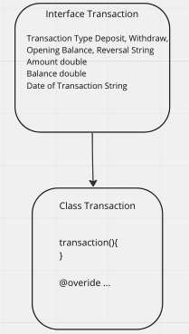
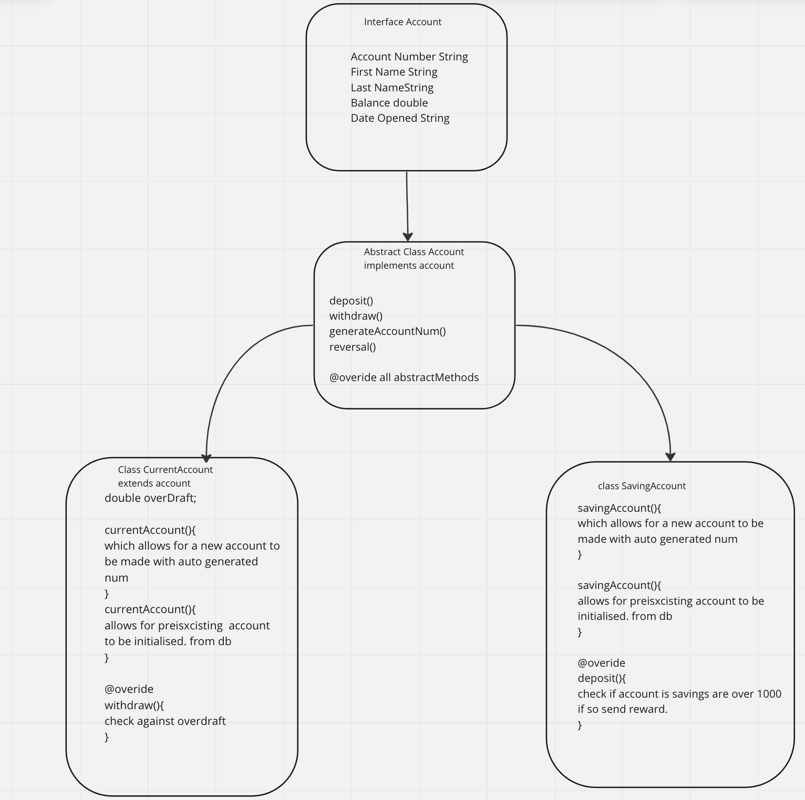
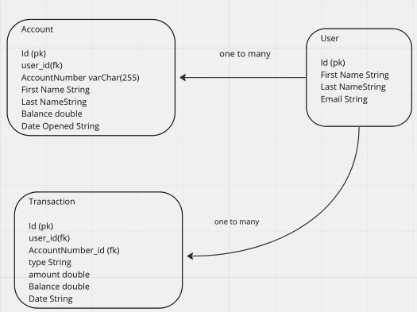

# Overview -Scenario and Design

You’ve been asked to design and implement a 3-Tier based Enterprise Java application for a Bank.The application will be available for online banking customers who can view their accounts (savings and current accounts etc.), switch accounts, and move funds/perform transactions.

## App Spec 
-Account numbers must be automatically generated from a starting integer value and given a prefix to indicate the account type.

- Each Object Type Current or savings accounts must be capable of storing transactional activity via a List/SetCollectionFieldsTransaction TypeDeposit, Withdraw, Opening Balance, Reversal Amount double Balance double Date of TransactionLocalDateTime

- Transaction info should be stored in a structure which is added to the list.

- The list of transactions should only be accessed via a Restful APIend-point.

- Methods for deposit and withdrawing should be provided.

- Only Current accounts are allowed to go overdrawn

- You can set an overdraft limit on current account creation

- If the overdraft limit is exceeded as the result of a transaction an exception should be thrown and the transaction reversed

- If no overdraft is in place and the account goes overdrawn an exception should be thrown and the transaction reversed

- All attempts to go overdrawn or exceed the limit will be entered in the transaction history as a reversal and written to a database table containing the account number, name and amount that was attempted to be withdrawn along with the balance at the time and the overdraft amount if any.

- If a savings account exceeds £1000 an exception will be thrown to inform the customer,they qualify for Mystery reward / offer. A web service will be called which will return a description of a prize. A flag must be set on the account not to offer a reward again until they have a thousand pounds more in the account. 

## Class Designs

### Transaction class design 

### Account class design 

### Database Design 

## Sprints

### sprint1

as a user 
i should be able to sign in 
with my email and password 

as a user 
i should be able to create an
account

as a user 
i should be able to create a account

### sprint2

as a user 
i should be able to see all 
accounts in dashboard 

as a user 
i should be able to deposit 
money into my account 

as a user 
i should be able to withdraw money from my account 

as a user 
i should be able to see
all transactions related to an account 
